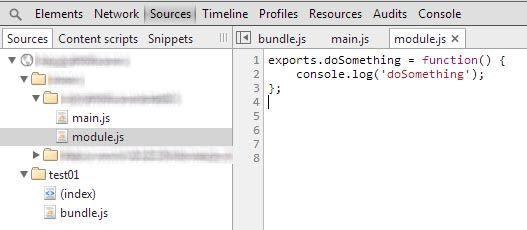

Introduction
============
[Browserify](https://github.com/substack/node-browserify) allows the use of [CommonJS](http://wiki.commonjs.org/wiki/Modules/1.1) modules directly in the browser.

These modules can solve the problems of dependencies that can be encountered in Javascript. 

Each dependency is encapsulated. Variables exposed by a module are explicitly defined. 

In practice 
===========

Example of a CommonJS Module

__module.js__
```javascript
exports.doSomething = function(options) {
	console.log('doSomething');
};	
```

and its use

__main.js__
```javascript
var module = require('./module');
module.doSomething();	
```

We use __exports__ keyword to expose a variable (a function in our case) and the __require()__ keyword to import a dependency.

File __ bundle.js__ bringing together all your code using the command __ browserify__ it generates.

```javascript
browserify main.js > bundle.js
```

The file __bundle.js__ is a "pseudo" concatenation of two files.

__bundle.js__
```javascript
(function e(t,n,r){function s(o,u){if(!n[o]){if(!t[o]){var a=typeof require=="function"&&require;if(!u&&a)return a(o,!0);if(i)return i(o,!0);throw new Error("Cannot find module '"+o+"'")}var f=n[o]={exports:{}};t[o][0].call(f.exports,function(e){var n=t[o][1][e];return s(n?n:e)},f,f.exports,e,t,n,r)}return n[o].exports}var i=typeof require=="function"&&require;for(var o=0;o<r.length;o++)s(r[o]);return s})({1:[function(require,module,exports){
var module = require('./module');

module.doSomething();


},{"./module":2}],2:[function(require,module,exports){
exports.doSomething = function() {
    console.log('doSomething');
};	
```

You can include it in your page as below.

__index.html__
```markup
<script src="js/bundle.js"></script>	
```


__bundle.js__ file is unusable for debugging. But browserify has done its job and the code is still functional. 

It is far from the complexity of modules declaration with [RequireJS](http://requirejs.org/).


How to work with Browserify ?
=============================

How to use browserify in your dev environment or in our workflow?

First solution 
==============

You can use the parameter __--debug__.

```javascript
browserify main.js --debug > bundle.js
```

This will allow to generate meta-data called "SourceMapping" for referencing our source files. 

The meta-data can be exploited later for possible debugging.

__bundle.js__
```javascript
# sourceMappingURL=data:application/json;base64,eyJ2ZXJzaW9uIjozLCJmaWxlIjoiZ2VuZXJhdGVkLmpzIiwic291cmNl
```

By activating the "JS Sourcemap" in Chrome, you can see our source files.



Warning, these data must remain visible only for debug.


Second solution
===============

You can use [Grunt](http://gruntjs.com/) and its plugin [grunt-browserify](https://github.com/jmreidy/grunt-browserify) to compile files on the fly.


__index.html__
```markup
<script src="dist/bundle.js"></script>	
```

__Gruntfile.js__
```javascript
module.exports = function(grunt) {
	grunt.initConfig({
    	pkg: grunt.file.readJSON('package.json'),
    	browserify: {
	      './public/dist/bundle.js': ['./public/js/bundle.js']
	    },
	    watch: {
	      	files: ['public/js/**/*.js'],
	      	tasks: ['browserify']
	    }
  	})

	grunt.loadNpmTasks('grunt-browserify');
	grunt.loadNpmTasks('grunt-contrib-watch');

	grunt.registerTask("default", ["watch"]);
};
```

Whenever you change a file in the "public/js/**/*.js" directory, the "browserify" task is executed.


Conclusion
==========

Integrating __browserify__ in your dev environment is quite simple. 

You can now use the CommonJS modules and better manage your dependencies and therefore the success of your projects.