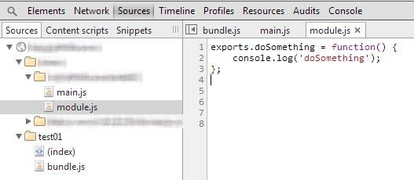

Introduction
============
[Browserify](https://github.com/substack/node-browserify) permet d'utiliser des modules dit [CommonJS](http://wiki.commonjs.org/wiki/Modules/1.1) directement dans le navigateur.

Ces modules permettent de résoudre les problématiques de dépendances qu'on peut rencontrer fréquemment dans le monde du Javascript.

Chaque dépendance est encapsulée. Les variables exposées par un module sont définies explicitement.

Dans la pratique
================

Exemple d'un module CommonJS

__module.js__
```javascript
exports.doSomething = function(options) {
	console.log('doSomething');
};	
```

et son utilisation

__main.js__
```javascript
var module = require('./module');
module.doSomething();	
```

On utile le mot-clef __exports__ pour exposer une variable et la méthode __require()__ pour importer une dépendance.

On génére le fichier __bundle.js__ qui rassemblera tout notre code en utilisant la commande __browserify__.

```javascript
browserify main.js > bundle.js
```

Le fichier __bundle.js__ est une "pseudo" concaténation des deux fichiers.

__bundle.js__
```javascript
(function e(t,n,r){function s(o,u){if(!n[o]){if(!t[o]){var a=typeof require=="function"&&require;if(!u&&a)return a(o,!0);if(i)return i(o,!0);throw new Error("Cannot find module '"+o+"'")}var f=n[o]={exports:{}};t[o][0].call(f.exports,function(e){var n=t[o][1][e];return s(n?n:e)},f,f.exports,e,t,n,r)}return n[o].exports}var i=typeof require=="function"&&require;for(var o=0;o<r.length;o++)s(r[o]);return s})({1:[function(require,module,exports){
var module = require('./module');

module.doSomething();


},{"./module":2}],2:[function(require,module,exports){
exports.doSomething = function() {
    console.log('doSomething');
};	
```

Vous pouvez l'inclure dans votre page comme ci-dessous.

__index.html__
```markup
<script src="js/bundle.js"></script>	
```


Le fichier __bundle.js__ est inexploitable pour le débogage. Mais browserify a fait son travail et le code est néanmoins fonctionnel.

On est bien loin de la complexité de déclaration des modules avec [RequireJS](http://requirejs.org/).


Comment travailler avec Browserify ?
====================================

Comment utiliser browserify dans votre environnement de dev ou dans votre workflow ?

1ère solution
=============

On peut utiliser le paramètre _--debug_ de browserify.

```javascript
browserify main.js --debug > bundle.js
```

Cela va permettre de générer des meta-données dit "SourceMapping" permettant de référencer nos fichiers sources.

Les meta-données pourront être exploiter par la suite pour un débogage éventuel.

__bundle.js__
```javascript
# sourceMappingURL=data:application/json;base64,eyJ2ZXJzaW9uIjozLCJmaWxlIjoiZ2VuZXJhdGVkLmpzIiwic291cmNl
```

En activant les "JS SourceMap" dans Chrome, on peut voir nos fichiers sources.



Attention, ces données doivent rester visible exclusement pour le debug.


2ème solution
=============

On peut utiliser [Grunt](http://gruntjs.com/) et son plugin [grunt-browserify](https://github.com/jmreidy/grunt-browserify) pour compiler les fichiers à la volée.


__index.html__
```markup
<script src="dist/bundle.js"></script>	
```

__Gruntfile.js__
```javascript
module.exports = function(grunt) {
	grunt.initConfig({
    	pkg: grunt.file.readJSON('package.json'),
    	browserify: {
	      './public/dist/bundle.js': ['./public/js/bundle.js']
	    },
	    watch: {
	      	files: ['public/js/**/*.js'],
	      	tasks: ['browserify']
	    }
  	})

	grunt.loadNpmTasks('grunt-browserify');
	grunt.loadNpmTasks('grunt-contrib-watch');

	grunt.registerTask("default", ["watch"]);
};
```

Dès que vous modifiez un fichier dans le répertoire "public/js/**/*.js", la tâche "browserify" est executée.


Conclusion
==========

L'intégration de __browserify__ dans votre environnement de dev est assez simple.

N'attendez donc plus pour bénéficer des modules CommonJS.

Vous pourrez ainsi mieux gérer vos dépendances et donc la réussite de vos projets.