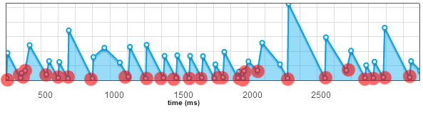

Simple approach
---------------
To handle this event, you declare a listener on the event __ resize__ (below with jQuery).
```javascript
$(window).on('resize', function() {
	// traitement
});
```

What happens there ?
--------------------
If you change the size of your browser, you receive multiple events "resize".


The problem is that you receive unnecessary events.

The properties of the viewport are not necessarily changed between two events.

No browser seems to implement this feature correctly for the moment.

For an event __ "theoretical" resize__ , you receive several identical events.

The performance of your application can be degrade in a major way if you do not treat this problem.

In order to be sure, I conducted a study to show this phenomenon (cf. [jquery.trueresize](https://github.com/jfroffice/jquery.trueresize))



Events parasites are represented in red on the diagram above.

Workaround
----------
This problem was focused by [__@paulirish__](https://twitter.com/paul_irish) in [2009](http://paulirish.com/2009/throttled-smartresize-jquery-event-handler/). Several JS libraries treat this problem as [underscore](http://underscorejs.org/#debounce) or [smartresize](https://github.com/louisremi/jquery-smartresize/).


Remove unnecessary events
-------------------------
[jquery.trueresize](https://github.com/jfroffice/jquery.trueresize) is a light implementation _(147bytes)_.

Utilisation
-----------
you declare a listener on the event __trueresize__ and not on resize.
```javascript
$(window).on('trueresize', function() {
    // traitement
});
```

Conclusion
----------
Well, I hope that this demonstration will have been useful in order to deal with the __resize__ event.

Remember why you want to listen to the event __ resize__ ? most of the time it's useless.