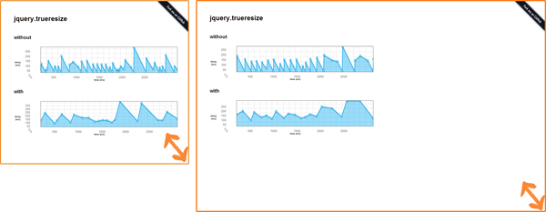
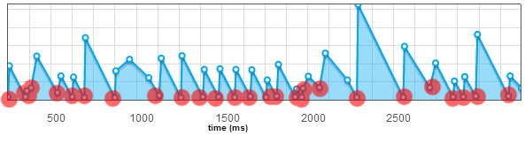
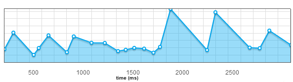

Approche simple
---------------
Pour gérer cet évènement, vous déclarez un listener sur l'évènement __resize__ (ci-dessous avec jQuery)
```javascript
$(window).on('resize', function() {
	// traitement
});
```

Que se passe t'il ?
-------------------
Si vous modifiez la taille de votre navigateur, vous recevez plusieurs évènements "resize".



Le problème est que vous recevez des évènements inutiles.

Les propriétés du viewport ne sont pas forcément modifiées entre 2 évènements.

Aucun navigateur ne semble implémenter cette fonctionnalité correctement pour le moment.

Pour un évènement __resize__ "théorique", vous recevez plusieurs évènements identiques.

Les performances de votre application peuvent dégrader de façon majeure si vous ne traitez pas ce problème.

Afin d'en avoir le coeur net, j'ai réalisé une étude afin de montrer ce phénomène (cf. [jquery.trueresize](https://github.com/jfroffice/jquery.trueresize))



Les évènements parasites sont symbolisés en rouge sur le schéma ci-dessus.

Solution de contournement
-------------------------
Ce problème a été remonté par l'excellent [__@paulirish__](https://twitter.com/paul_irish) en [2009](http://paulirish.com/2009/throttled-smartresize-jquery-event-handler/). Plusieurs libraires traitent ce problème tel que [underscore](http://underscorejs.org/#debounce) ou la librairie [smartresize](https://github.com/louisremi/jquery-smartresize/).



Suppression des évènements parasites
------------------------------------
[jquery.trueresize](https://github.com/jfroffice/jquery.trueresize) est une implémentation allégée _(147bytes)_ permettant de résoudre ce problème.

Cette librairie vous autorise jusqu'à 50 images par seconde.

Utilisation
-----------
Son fonctionnement est simple, vous déclarez un listener sur l'évènement __trueresize__ et non __resize__
```javascript
$(window).on('trueresize', function() {
    // traitement
});
```

Conclusion
----------
Voilà, j'espère que cette démonstration vous aura été utile afin d'appréhender au mieux l'évènement __resize__.

Souvenez-vous pourquoi vous voulez écouter l'évènement __resize__ ? la plupart du temps c'est inutile.
